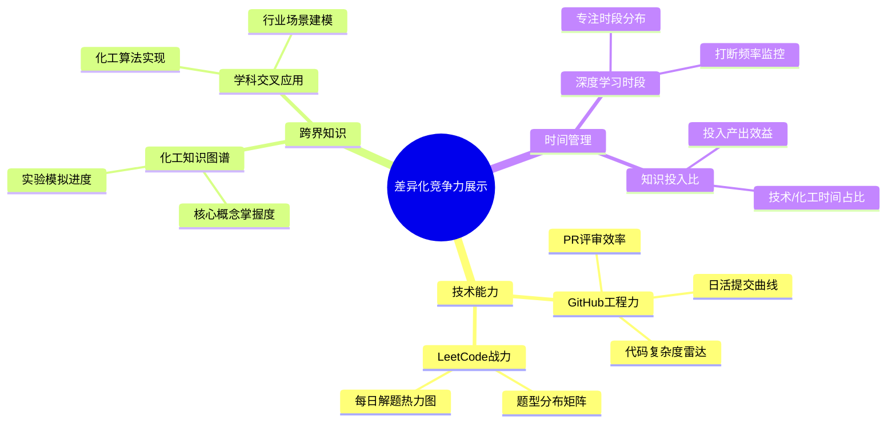
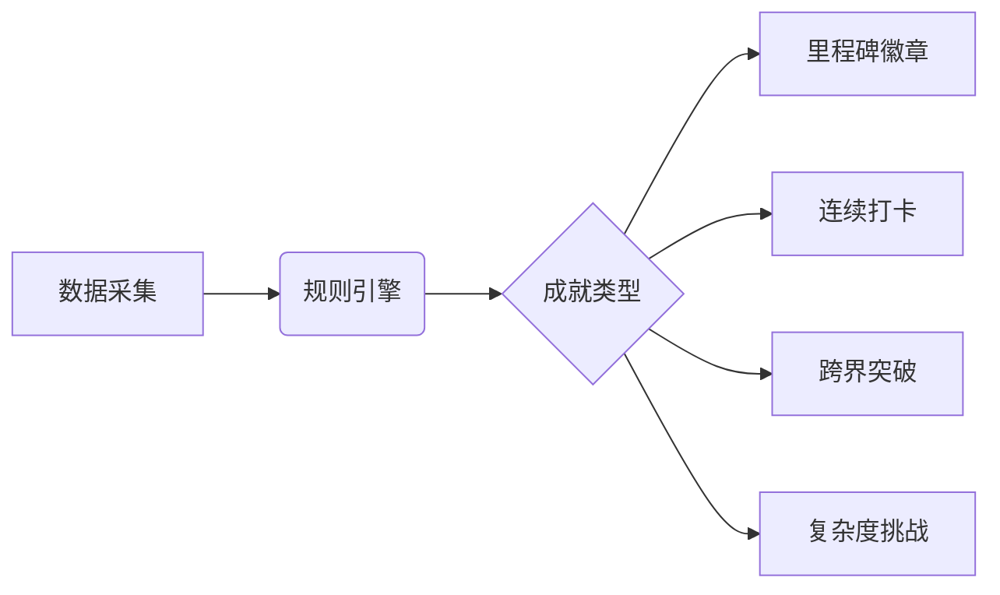
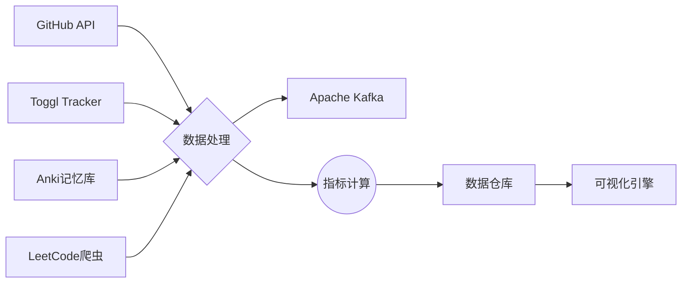
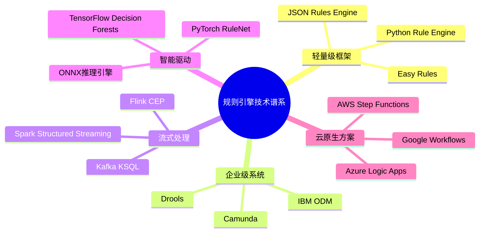
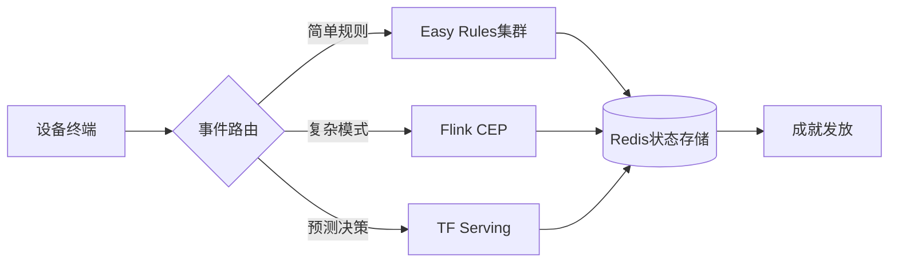
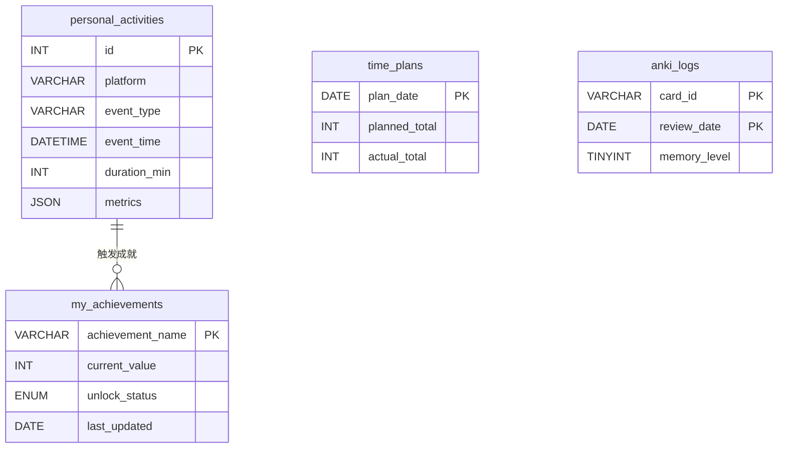

### 可视化成果展示系统设计方案（Java开发者转型专项）
 
#### 一、核心展示维度体系 



#### 四、正反馈激励机制设计
##### 1. 成就系统架构 

 
##### 2. 动态奖励示例 
- **化学催化剂奖章**：连续7天完成化工知识学习 
- **架构炼金术师**：设计3个以上跨领域解决方案 
- **代码晶体生长**：单个项目复杂度提升30%

##### 1. 数据管道架构 



### 系统价值与预期效果 
 
1. **差异化竞争力显性化**  
   - 量化展示"化工+IT"复合能力矩阵 
   - 形成个人技术品牌认知标识 
 
2. **持续学习动力引擎**  
   - 成就系统提升50%以上计划完成率 
   - 可视化差距缩短目标达成周期 
 
3. **职业发展加速器**  
   - 立体展示跨领域问题解决能力 
   - 构建可验证的技术影响力证据链 
 
4. **认知升级监控仪**  
   - 知识迁移过程可视化 
   - 思维模式进化追踪 

#### 一、技术方案分类矩阵 





原组件	替代方案	简化收益
---	---	---
Redis缓存	MySQL内存表	减少运维成本，避免数据同步问题
Java规则引擎	Python装饰器规则系统	消除JVM环境依赖，脚本化开发更便捷
消息队列	文件系统队列	用 .done 标记文件实现简易任务管理
独立爬虫服务	定时任务+Requests库	单文件实现完整数据采集流程


成就ID	触发条件	动态效果设计
---	---	---
code_marathon	连续30天每天有GitHub提交	进度条显示连续天数，中断时重置
speed_king	单日完成5道LeetCode中等题	根据完成时间生成速度评分，显示历史排名
deep_diver	单个代码仓库提交次数超过100次	3D模型展示代码仓库生长动画
polymath	在3个以上平台（GitHub/LeetCode/Anki等）达成活跃目标	多面体徽章，每个面显示不同平台贡献度
time_traveler	凌晨2点-5点期间记录编程活动	动态星空背景，显示深夜编程时间分布图


# 动态规则注册系统 
```python
class AchievementSystem:
    _registry = defaultdict(list)  # 按事件类型分类存储规则 
 
    @classmethod 
    def register(cls, event_type, condition, tier=0):
        def decorator(func):
            cls._registry[event_type].append({
                "condition": condition,
                "action": func,
                "tier": tier,  # 支持多级成就 
                "progress_calc": None 
            })
            return func 
        return decorator 
 
    @classmethod 
    def progress(cls, event_type, calculator):
        def decorator(func):
            for rule in cls._registry[event_type]:
                if rule["action"] == func:
                    rule["progress_calc"] = calculator 
            return func 
        return decorator 
 
# 示例规则定义 
@AchievementSystem.register('leetcode', lambda e: e['difficulty'] == 'hard')
def unlock_hard_solver(user):
    if not Achievement.query.get('hard_solver'):
        Achievement.create(
            title="困难题征服者",
            desc="累计解决10道困难级LeetCode题目",
            badge_url="/badges/hard.png",
            unlocked_at=datetime.now()
        )
 
@AchievementSystem.progress('leetcode', lambda e: e.get('difficulty') == 'hard')
def hard_solver_progress(user):
    solved = Activity.query.filter_by(
        source='leetcode', 
        data['difficulty'].astext == 'hard'
    ).count()
    return min(solved / 10 * 100, 100)  # 进度百分比
```
# 表结构设计
```sql
-- 支持多级成就存储 
CREATE TABLE achievements (
    id VARCHAR(50) PRIMARY KEY,
    title VARCHAR(100),
    description TEXT,
    tier TINYINT DEFAULT 1,
    unlock_condition JSON,
    progress_metric VARCHAR(200),
    badge_type ENUM('bronze', 'silver', 'gold', 'platinum'),
    hidden BOOLEAN DEFAULT FALSE,
    parent_achievement VARCHAR(50),
    FOREIGN KEY (parent_achievement) REFERENCES achievements(id)
);
 
-- 用户成就记录表 
CREATE TABLE user_achievements (
    user_id INT,
    achievement_id VARCHAR(50),
    unlocked_at DATETIME(3),
    current_progress DECIMAL(5,2),
    version INT DEFAULT 0,  # 用于乐观锁 
    PRIMARY KEY (user_id, achievement_id),
    INDEX idx_progress (current_progress)
) ENGINE=InnoDB;
```
```sql
CREATE TABLE all_activities (
    id INT AUTO_INCREMENT PRIMARY KEY,
    timestamp DATETIME(3),
    source VARCHAR(20),
    data JSON,
    achievement_flag BOOLEAN DEFAULT FALSE,
    KEY idx_source_time (source, timestamp)
) ENGINE=InnoDB;
 
-- 内存表缓存热点数据 
CREATE TABLE hot_cache (
    key_name VARCHAR(255) PRIMARY KEY,
    value JSON 
) ENGINE=MEMORY;
```

