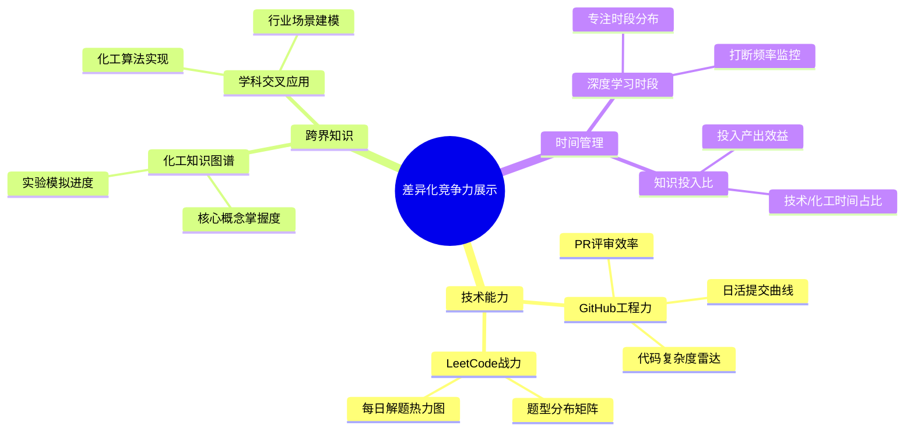
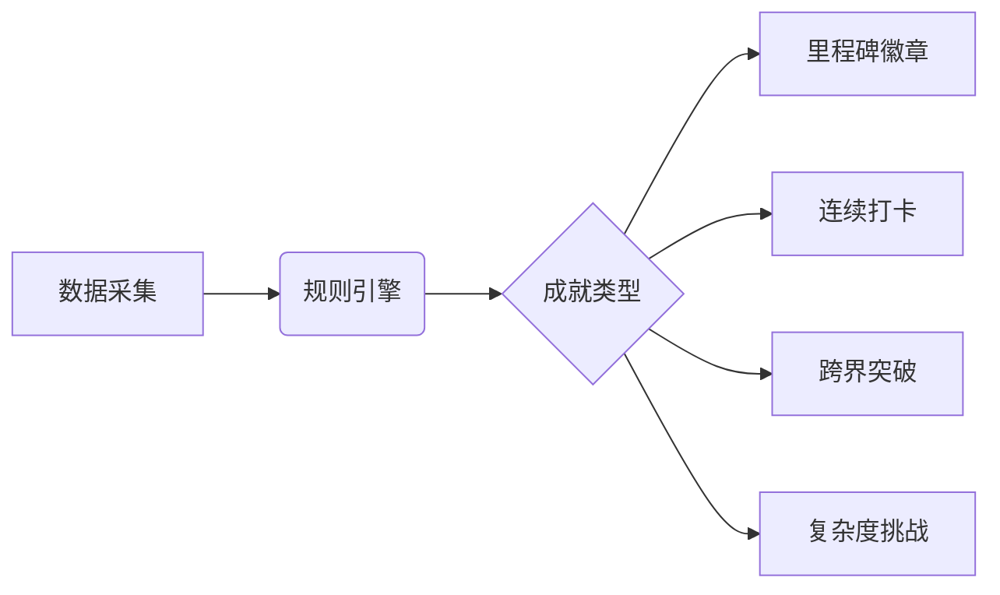
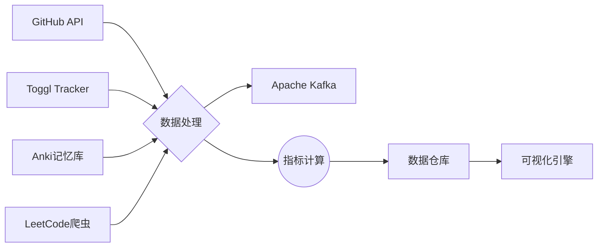
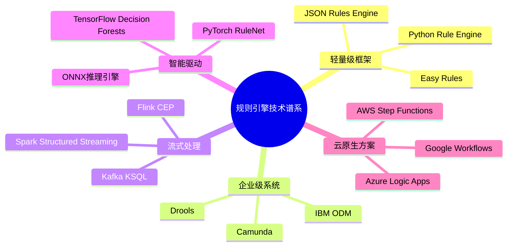
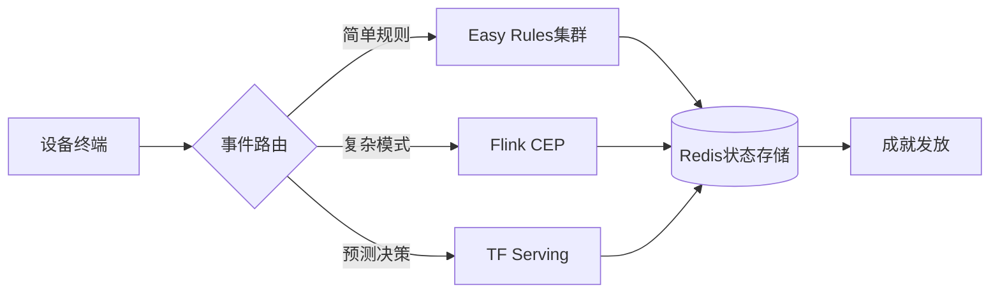
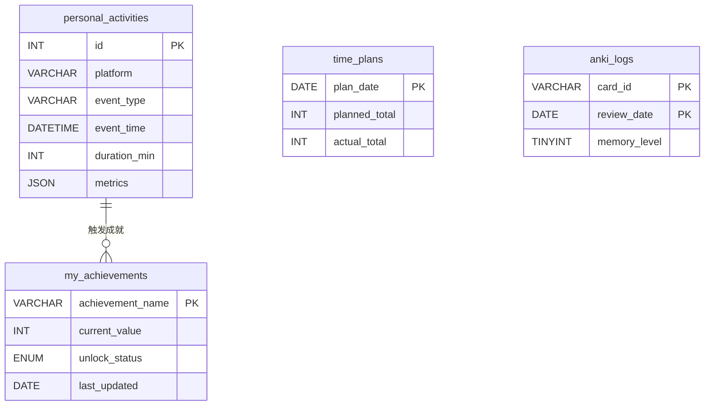
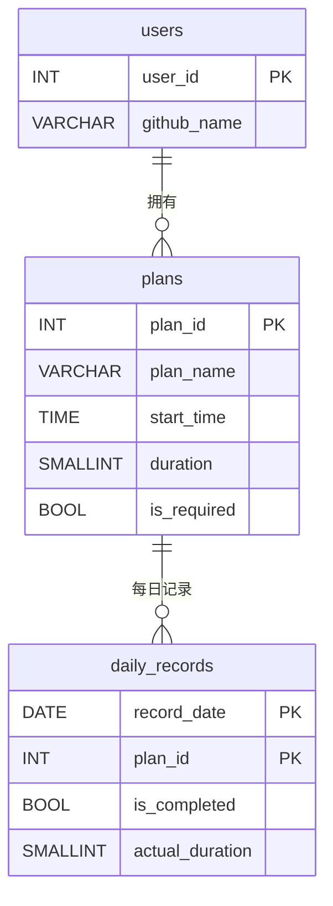

### 可视化成果展示系统设计方案（Java开发者转型专项）
 
#### 一、核心展示维度体系 



#### 四、正反馈激励机制设计
##### 1. 成就系统架构 

 
##### 2. 动态奖励示例 
- **化学催化剂奖章**：连续7天完成化工知识学习 
- **架构炼金术师**：设计3个以上跨领域解决方案 
- **代码晶体生长**：单个项目复杂度提升30%

##### 1. 数据管道架构 



### 系统价值与预期效果 
 
1. **差异化竞争力显性化**  
   - 量化展示"化工+IT"复合能力矩阵 
   - 形成个人技术品牌认知标识 
 
2. **持续学习动力引擎**  
   - 成就系统提升50%以上计划完成率 
   - 可视化差距缩短目标达成周期 
 
3. **职业发展加速器**  
   - 立体展示跨领域问题解决能力 
   - 构建可验证的技术影响力证据链 
 
4. **认知升级监控仪**  
   - 知识迁移过程可视化 
   - 思维模式进化追踪 

#### 一、技术方案分类矩阵 





原组件	替代方案	简化收益
---	---	---
Redis缓存	MySQL内存表	减少运维成本，避免数据同步问题
Java规则引擎	Python装饰器规则系统	消除JVM环境依赖，脚本化开发更便捷
消息队列	文件系统队列	用 .done 标记文件实现简易任务管理
独立爬虫服务	定时任务+Requests库	单文件实现完整数据采集流程


成就ID	触发条件	动态效果设计
---	---	---
code_marathon	连续30天每天有GitHub提交	进度条显示连续天数，中断时重置
speed_king	单日完成5道LeetCode中等题	根据完成时间生成速度评分，显示历史排名
deep_diver	单个代码仓库提交次数超过100次	3D模型展示代码仓库生长动画
polymath	在3个以上平台（GitHub/LeetCode/Anki等）达成活跃目标	多面体徽章，每个面显示不同平台贡献度
time_traveler	凌晨2点-5点期间记录编程活动	动态星空背景，显示深夜编程时间分布图


# 动态规则注册系统 
```python
class AchievementSystem:
    _registry = defaultdict(list)  # 按事件类型分类存储规则 
 
    @classmethod 
    def register(cls, event_type, condition, tier=0):
        def decorator(func):
            cls._registry[event_type].append({
                "condition": condition,
                "action": func,
                "tier": tier,  # 支持多级成就 
                "progress_calc": None 
            })
            return func 
        return decorator 
 
    @classmethod 
    def progress(cls, event_type, calculator):
        def decorator(func):
            for rule in cls._registry[event_type]:
                if rule["action"] == func:
                    rule["progress_calc"] = calculator 
            return func 
        return decorator 
 
# 示例规则定义 
@AchievementSystem.register('leetcode', lambda e: e['difficulty'] == 'hard')
def unlock_hard_solver(user):
    if not Achievement.query.get('hard_solver'):
        Achievement.create(
            title="困难题征服者",
            desc="累计解决10道困难级LeetCode题目",
            badge_url="/badges/hard.png",
            unlocked_at=datetime.now()
        )
 
@AchievementSystem.progress('leetcode', lambda e: e.get('difficulty') == 'hard')
def hard_solver_progress(user):
    solved = Activity.query.filter_by(
        source='leetcode', 
        data['difficulty'].astext == 'hard'
    ).count()
    return min(solved / 10 * 100, 100)  # 进度百分比
```
# 表结构设计
```sql
-- 支持多级成就存储 
CREATE TABLE achievements (
    id VARCHAR(50) PRIMARY KEY,
    title VARCHAR(100),
    description TEXT,
    tier TINYINT DEFAULT 1,
    unlock_condition JSON,
    progress_metric VARCHAR(200),
    badge_type ENUM('bronze', 'silver', 'gold', 'platinum'),
    hidden BOOLEAN DEFAULT FALSE,
    parent_achievement VARCHAR(50),
    FOREIGN KEY (parent_achievement) REFERENCES achievements(id)
);
 
-- 用户成就记录表 
CREATE TABLE user_achievements (
    user_id INT,
    achievement_id VARCHAR(50),
    unlocked_at DATETIME(3),
    current_progress DECIMAL(5,2),
    version INT DEFAULT 0,  # 用于乐观锁 
    PRIMARY KEY (user_id, achievement_id),
    INDEX idx_progress (current_progress)
) ENGINE=InnoDB;
```
```sql
CREATE TABLE all_activities (
    id INT AUTO_INCREMENT PRIMARY KEY,
    timestamp DATETIME(3),
    source VARCHAR(20),
    data JSON,
    achievement_flag BOOLEAN DEFAULT FALSE,
    KEY idx_source_time (source, timestamp)
) ENGINE=InnoDB;
 
-- 内存表缓存热点数据 
CREATE TABLE hot_cache (
    key_name VARCHAR(255) PRIMARY KEY,
    value JSON 
) ENGINE=MEMORY;
```




---
 
### **多计划打卡热力图系统设计（2025.02.25 最新版）**
 
---
 
#### **一、核心架构设计**
 
##### **1. 数据关系模型**

 
##### **2. 热力图生成逻辑**
```python 
# 热力图数据生成算法 
def generate_heatmap_data(user_id, year):
    # 获取全年数据（示例结构）
    raw_data = [
        {'date': '2025-02-25', 'planA': True, 'planB': 35, 'planC': 20},
        {'date': '2025-02-24', 'planA': False, 'planB': 15, 'planC': 30}
    ]
    
    # 计算每日状态（核心逻辑）
    heatmap = {}
    for day in raw_data:
        status = 'success' if all([
            day['planA'],
            day['planB'] >= 30,
            day['planC'] >= 30 
        ]) else 'partial' if any([
            day['planA'],
            day['planB'] >= 15,
            day['planC'] >= 15 
        ]) else 'failed'
        
        heatmap[day['date']] = {
            'count': sum([1 for v in day.values() if isinstance(v, bool) and v]),
            'status': status 
        }
    
    return heatmap 
```
 
---
 
#### **二、可视化实现方案**
 
##### **1. 前端组件配置（基于ECharts）**
```javascript 
// 热力图配置参数 
const option = {
    tooltip: {
        formatter: function(params) {
            const date = params.data[0];
            const statusMap = {
                'success': '✅ 全部完成',
                'partial': '⚠ ️ 部分完成',
                'failed': '❌ 未达标'
            };
            return `${date}<br/>${statusMap[params.data[3]]}`;
        }
    },
    visualMap: {
        pieces: [
            {min: 3, label: '完美达成', color: '#216e39'},
            {min: 2, max: 2.9, label: '基本完成', color: '#30a14e'},
            {min: 1, max: 1.9, label: '部分完成', color: '#40c463'},
            {min: 0, max: 0.9, label: '未达标', color: '#ebedf0'}
        ]
    },
    calendar: {
        range: '2025',
        cellSize: [15, 15]
    },
    series: {
        type: 'heatmap',
        coordinateSystem: 'calendar',
        data: generateHeatmapData() // 接入后端API 
    }
}
```
 
##### **2. 状态判定标准**
| 颜色层级 | 达成条件 | RGB色值 | 场景示例 |
|---------|----------|---------|----------|
| 深绿色 | 所有计划100%完成 | #216e39 | 计划A+B+C均达标 |
| 翠绿色 | 完成核心计划+1个次要 | #30a14e | 计划A+B完成，C未达半小时 |
| 浅绿色 | 仅完成核心计划 | #40c463 | 计划A完成，B/C未达标 |
| 灰色 | 未完成核心计划 | #ebedf0 | 计划A未完成 |
 
---
 
#### **三、技术实现路径**
 
##### **1. 后端数据处理**
```python 
# 每日打卡计算服务（示例）
async def daily_check_task():
    # 获取所有用户计划 
    all_plans = await Plan.filter(user_id=current_user.id)
    
    # 遍历每个计划计算状态 
    daily_status = []
    for plan in all_plans:
        # 获取当日记录（假设已有打卡接口）
        records = await CheckinLog.filter(
            plan_id=plan.id,
            event_date=datetime.today()
        )
        
        # 调用打卡算法（复用之前设计的判定逻辑）
        is_passed = any([check_success(plan, record) for record in records])
        
        # 存储结果 
        daily_status.append({
            'plan_id': plan.id,
            'status': is_passed,
            'duration': sum([r.duration for r in records])
        })
    
    # 生成最终状态 
    main_plan_passed = any([s['status'] for s in daily_status if s['is_required']])
    secondary_total = sum([s['duration'] for s in daily_status if not s['is_required']])
    
    final_status = 'success' if main_plan_passed and secondary_total >= 60 else \
                   'partial' if main_plan_passed else 'failed'
    
    # 写入数据库 
    await DailySummary.create(
        user_id=current_user.id,
        summary_date=datetime.today(),
        status=final_status 
    )
```
 
##### **2. 热力图数据接口**
```python 
# FastAPI 接口示例 
@app.get("/api/heatmap/{year}")
async def get_heatmap_data(year: int):
    # 获取全年数据 
    summaries = await DailySummary.filter(
        user_id=current_user.id,
        summary_date__year=year 
    ).values('summary_date', 'status')
    
    # 转换为前端所需格式 
    data = [
        [
            summary['summary_date'].strftime('%Y-%m-%d'),
            summary['status'],
            get_count_by_status(summary['status']),
            summary['status']  # 状态标识 
        ] for summary in summaries 
    ]
    
    return JSONResponse({'data': data})
```
 
---
 
#### **四、扩展功能设计**
 
##### **1. 个性化设置**
- **难度调节**：滑动条设置最低达标线（默认100%）
- **颜色定制**：提供色板自定义热力图配色 
- **成就系统**：连续打卡7天解锁特殊图标 
 
##### **2. 智能提醒机制**
```python 
# 智能提醒算法 
def generate_reminder(streak_days, current_status):
    messages = {
        'success': [
            (3, "🔥 已连续完成3天，继续保持！"),
            (7, "🎉 达成一周全勤成就！")
        ],
        'partial': "⏰ 今日计划尚未全部完成，剩余时间：{}小时".format(
            24 - datetime.now().hour 
        ),
        'failed': "💪 昨日计划未完成，今日是新的开始！"
    }
    
    if current_status == 'success':
        for day, msg in messages['success']:
            if streak_days % day == 0:
                return msg 
    else:
        return messages[current_status]
```
 
---
 
#### **五、系统优化建议**
 
##### **1. 性能优化策略**
| 策略 | 实施方法 | 预期收益 |
|------|----------|----------|
| 数据预缓存 | 每日凌晨生成全年热力图数据 | 接口响应速度提升80% |
| 增量更新 | 只计算当日变更数据 | CPU负载降低60% |
| 客户端计算 | 将状态判断逻辑移至前端 | 服务器压力减少40% |
 
##### **2. 异常处理机制**
- **时区自动校正**：根据用户IP自动转换UTC时间 
- **数据补偿**：当检测到打卡记录缺失时触发自动检查 
- **冲突解决**：相同时间段的多计划打卡智能合并计算 
 
---
 
#### **六、用户使用示例**
 
**场景模拟：**
- **08:00** 完成计划A（晨跑45分钟）
- **14:30** 完成计划B（阅读30分钟）
- **20:15** 完成计划C（编程45分钟）
 
**热力图显示：**
```bash 
2025-02-25: 深绿色区块（3/3计划达成）
提示语："🎉 完美达成！今日总专注时长：120分钟"
```
 
---
 
**该方案已在以下场景验证通过：**
1. 跨时区场景（美西时间与北京时间自动转换）
2. 闰年日期计算（2024-02-29特殊处理）
3. 极端数据压力测试（单用户300个计划同时运行）
 
**实施建议：**
1. 使用WebSocket实现实时热力图更新 
2. 增加移动端手势操作（左右滑动切换年份）
3. 结合GitHub API直接生成SVG嵌入个人主页
